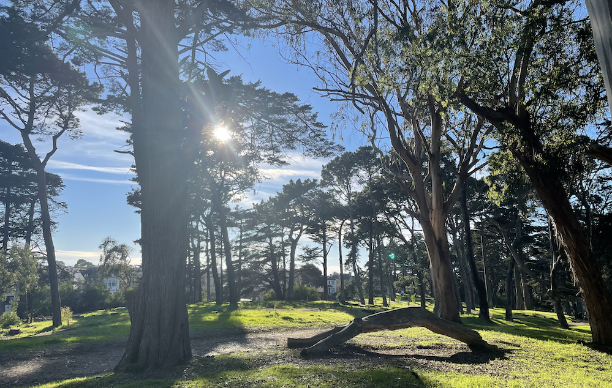

{:refdef: style="text-align: center;"}
{:class="img-responsive" style="max-width: 100%; height: auto;"}
{: refdef}

 

👋 Hello! 👋

Come picnic with us to celebrate our marriage! We're having a tiny family wedding and are inviting our friends and
extended community to celebrate with us over a lunch picnic at **Hellman Hollow
in Golden Gate Park** on May 7, 2022.

We ask that you **please RSVP** by filling out this form!

 

## 📅 Schedule

<table style="border-style: hidden; background-color: white" width="70%">
  <tbody>
    <tr style="background-color: white">
      <td style="border-style: hidden; text-align: center;"> </td>
      <td style="text-align: center; border-style: hidden;"> </td>
    </tr>
     <tr style="background-color: white">
      <td style="border-style: hidden; text-align: center;"> </td>
      <td style="text-align: center; border-style: hidden;"><strong>Saturday, May 7 2022</strong></td>
    </tr>
    <tr style="background-color: white">
      <td style="border-style: hidden; text-align: center;">11:30 AM</td>
      <td style="text-align: center; border-style: hidden;">Arrive at Hellman Hollow</td>
    </tr>
    <tr style="background-color: white">
      <td style="border-style: hidden; text-align: center;">12:00 PM</td>
      <td style="text-align: center; border-style: hidden;">Picnic lunch and games</td>
    </tr>
    <tr style="background-color: white">
      <td style="border-style: hidden; text-align: center;">1:30 PM</td>
      <td style="text-align: center; border-style: hidden;">Dessert! with toasts & readings</td>
    </tr>
    <tr style="background-color: white">
      <td style="border-style: hidden; text-align: center;">2:00 PM</td>
      <td style="text-align: center; border-style: hidden;">Picnic continues...stay as long as you wish!</td>
    </tr>
  </tbody>
</table>

## 🧺 Directions

We'll be at Tables #13-#18 in Hellman Hollow! That's the most southwestern corner of that area.

If arriving by bike/feet/rollerblades/longboard/unicycle, you probably don't need directions, you do you!

The 5/7 buses are good options for public transportation. They'll drop you off on the park's borders and you can walk in.

This is an area of the park immediately west of the section of JFK that's closed to cars. If driving, plan on parking on Tranverse / Crossover Drive, or further west on JFK. 

  

<iframe src="https://www.google.com/maps/embed?pb=!1m18!1m12!1m3!1d4005.8938760604483!2d-122.48312019362328!3d37.769611411229185!2m3!1f0!2f0!3f0!3m2!1i1024!2i768!4f13.1!3m3!1m2!1s0x80858775227b36f7%3A0x2e4d6f7a7f2e2431!2sHellman%20Hollow!5e0!3m2!1sen!2sus!4v1647155558693!5m2!1sen!2sus" width="600" height="450" style="border:0;" allowfullscreen="" loading="lazy"></iframe>

  

 

## 📸 Photos

Once we get closer to the event, we'll post a link here to upload photos.

[album]: https://photos.app.goo.gl/xdXo85k2QW2CSyR17

 

## 🤔 FAQ

> For any questions not covered, please contact
> [Buro](mailto:mookerji@gmail.com) and [Maggie](mailto:emmbeezee@gmail.com)
> directly.

 

### 🥧  What should I bring?

Yourself! If you're local, bring something to sit on (lawn chair / blanket). We'll have plenty of extras for travellers or if you forget. 

We'll be providing lunch and drinks for everybody. If you're excited about making a celebratory dessert, let us know in the registration form.

 

### 🙋 Can I help?

Absolutely! Checkout the registration form for ideas or reach out to us directly.

 

### 👪 Can I bring a +1? Children? Dog? My +1's child's dog?

Yes. Just let us know who to expect in the registration form.

 

### 🧥 What should I wear?

Dress code wise, come as you are. But we'd be remiss if we didn't remind you that this is a foggy area of the city. Bring layers and expect wind.

 

### 💍  Whoa, you're getting married?

Yes! We were planning to have an SF City Hall wedding in April 2020, but ...

TODO

 

    <strong>
        <i>
            🎉&nbsp;&nbsp; SEE YOU SOON! &nbsp;&nbsp;🥳
        </i>
    </strong>

 
 

P.S. Enjoy this slideshow of photos from the last decade of our friendship.

 
 


